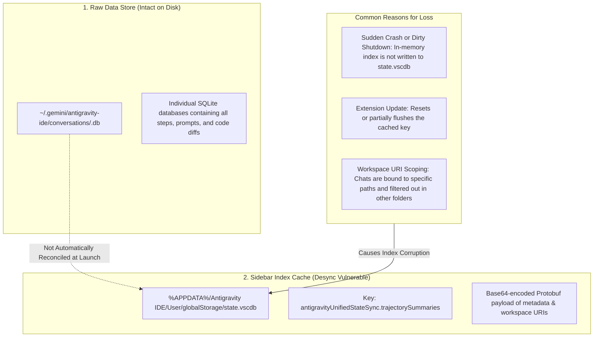

<div align="center">

#  Antigravity Chat Recovery Toolkit

**A zero-dependency recovery and indexing utility for Google Antigravity IDE.**  
Restore missing, dropped, or desynced past conversations in your sidebar across Windows, macOS, Linux, and WSL.

[](https://github.com/Maleesha-K/antigravity-chat-recovery/actions)
[](https://www.python.org/)
[](https://opensource.org/licenses/MIT)
[-success.svg)](#)

</div>

---

> [!WARNING]
> ### ⚠️ Notice: Semi-Permanent Fix vs. Upstream Limitation
> This toolkit provides a **semi-permanent client-side recovery** for your existing conversations. Once run, all your discovered past conversations will immediately reappear in Antigravity's sidebar and remain accessible across normal sessions.
>
> However, because Google Antigravity currently **lacks an automatic startup reconciliation routine** between its raw storage and its UI cache, future sudden crashes, hard restarts, or extension updates can cause newly created conversations to desync again. A truly permanent fix requires Google to add automatic startup cache validation directly into the IDE. Until then, you can simply run this utility whenever you notice missing chats.

---

##  Why Past Conversations Disappear

In Antigravity IDE, your chat history is managed using a **two-tier architecture**:



1. **The Raw Storage:** Your actual messages, plans, and diffs are safely written to individual SQLite database files in `~/.gemini/antigravity-ide/conversations/`.
2. **The Sidebar Cache:** The "Past Conversations" sidebar in the IDE **never queries those files directly**. Instead, it reads a single Protobuf-encoded index (`trajectorySummaries`) inside VS Code's `state.vscdb`.
3. **The Root Cause:** If the IDE crashes, updates, or fails to flush memory cleanly, individual `.db` files remain on disk, but their index entries drop out of `state.vscdb`. **Antigravity has no startup reconciliation loop**, leaving your chats stranded and invisible.

---

##  Features

-  **Zero External Dependencies:** Built 100% on Python standard library (`sqlite3`, `struct`, `os`, `sys`). No `pip install` required.
-  **Safe & Non-Destructive:** Automatically creates a timestamped snapshot backup of `state.vscdb` before writing any data.
-  **One-Command Rollback:** Instantly restore previous state with `--rollback`.
-  **Active Process Guard:** Detects if Antigravity is running to prevent SQLite write locks or in-memory overwrites upon application exit.
-  **Preserves Workspace Bindings:** Automatically extracts workspace URIs (`file:///...`) from conversation blobs so chats reappear in the exact matching project sidebars.
-  **Cross-Platform:** Works seamlessly on Windows, macOS, Linux, and WSL.

---

##  Quick Start

### Prerequisites
Make sure **Antigravity IDE is completely closed** (`File` → `Exit`) before running the tool.

### Method 1: 1-Click Launchers (Recommended)

#### Windows
1. Download or clone this repository.
2. Double-click **`run.bat`**.

#### macOS / Linux / WSL
```bash
git clone https://github.com/Maleesha-K/antigravity-chat-recovery.git
cd antigravity-chat-recovery
chmod +x run.sh
./run.sh
```

---

### Method 2: Python Command Line

```bash
# Preview discovered conversations without modifying anything
python -m antigravity_restore.cli --dry-run

# Run full restoration (creates backup and writes index)
python -m antigravity_restore.cli

# Roll back to the previous snapshot if needed
python -m antigravity_restore.cli --rollback
```

---

## 🛠️ CLI Options

| Option | Description |
| :--- | :--- |
| *(default)* | Scans all conversation directories, backs up `state.vscdb`, and rebuilds the index. |
| `--dry-run` | Discovers and displays all conversation IDs and titles without making changes. |
| `--rollback` | Restores `state.vscdb` from the most recent automatic snapshot backup. |
| `--force` | Bypasses the running process check (use only if running in automated headless pipelines). |

---

##  Running Tests

The test suite requires zero third-party testing packages:

```bash
python -m unittest discover -s tests
```

---

##  Contributing

Contributions, feedback, and issue reports are warmly welcomed! Please read [`CONTRIBUTING.md`](CONTRIBUTING.md) to get started.

---

## 📄 License

This project is licensed under the [MIT License](LICENSE).
